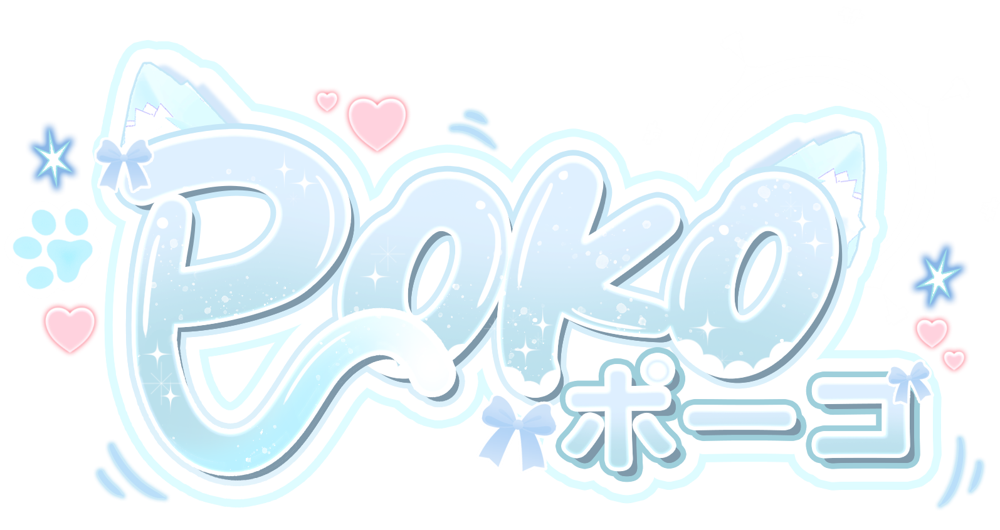

<div align="center">
  

  <h1>PokoProfile</h1>

  <p>
    A soft pastel-blue PokoOS portfolio for System Engineer and DevOps-focused work.
  </p>

  <p>
    
    
    
  </p>
</div>

## About

PokoProfile turns a personal portfolio into a tiny desktop environment. It opens with a PokoOS boot screen, then gives visitors a Linux-style terminal, VRChat gallery, and browser-side system monitor in draggable liquid-glass windows.

The visual direction is calm, airy, and light-blue friendly: polished enough for portfolio work, but still personal and soft.

## Highlights

- PokoOS boot animation with a responsive desktop layout.
- Linux-style portfolio terminal with profile and DevOps commands.
- Liquid-glass app windows inspired by modern macOS design.
- VRChat Gallery with optimized WebP images, thumbnails, transitions, and slideshow controls.
- System Monitor for browser-side CPU/event-loop and memory signals.
- Light and dark mode support.

## Development

Install dependencies and start the Next.js development server:

```bash
npm install
npm run dev
```

Build or run the production server:

```bash
npm run build
npm start
```

## Deployment

The app includes non-root deployment artifacts:

```bash
docker build --build-arg NEXT_PUBLIC_SITE_URL=https://poko.caferabbit.com -t poko-portfolio:latest .
kubectl apply -f deployment.yaml
kubectl apply -f service.yaml
```

Update `NEXT_PUBLIC_SITE_URL` in the Docker build arg and `deployment.yaml` before production so SEO canonical, robots, sitemap, Open Graph, and Twitter metadata use the real site URL.

## Project Map

- `app/` contains the Next.js App Router entry, global CSS, robots, sitemap, and SEO metadata.
- `components/` contains the React liquid-glass window system, top taskbar, terminal app, gallery app, monitoring app, and boot screen.
- `hooks/` contains terminal commands, gallery data, client metrics, and draggable window state.
- `public/images/` contains the live site assets.
- `public/images/vrchat/` contains optimized VRChat WebP images and thumbnails.
- `Dockerfile`, `deployment.yaml`, and `service.yaml` define the non-root container and Kubernetes deployment.
- `Backup/` is the archived pre-framework static version.

## Palette Note

The README and UI lean into a pastel sky palette:

`#AEDFFF` `#B8E7FF` `#C7EEFF` `#EAF8FF` `#F5FCFF`
